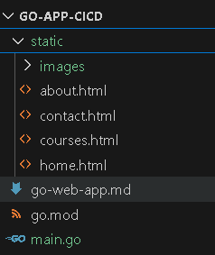

# Implementation steps

----------------------------------------------------

# 1. Understanding & testing the Project Locally:

**a.** Get the app code from developer team and clone/copy locally.



**b.** Generally you will get above code from developer, Where:

- static folder contains web app code.

- The main.go file is the entry point of your Go application. It contains the main() function where your program execution begins.

- The go.mod file declares the module path and tracks the project's dependencies. If you don't get it, then initialize your Go module in your local terminal:
```
go mod init github.com/<git-username>/<git-repo>
```
example:
```
go mod init github.com/nikhil600/go-app-cicd
```

- "main" is the compiled binary. The below command is used to build the Go application and compile it into a binary executable file. Below is how you can build it:
```
go build -o main main.go
```
- Once the main binary is created, it can be executed using ./main or go run main.go to run the application in local to test it.
```
go run main.go
```
If the process is running and want to terminate use below:
```
Get-Process | Where-Object {$_.Name -eq "main" -or $_.ProcessName -eq "main"} | Stop-Process -Force -ErrorAction SilentlyContinue; "Process terminated"
```

Note: The server will start on port 8080. You can not access web-app on localhost:8080. As per developer instructions you can access it by navigating to http://localhost:8080/courses in your web browser.


# 2. Containerization with Multi-Stage Dockerfile:

